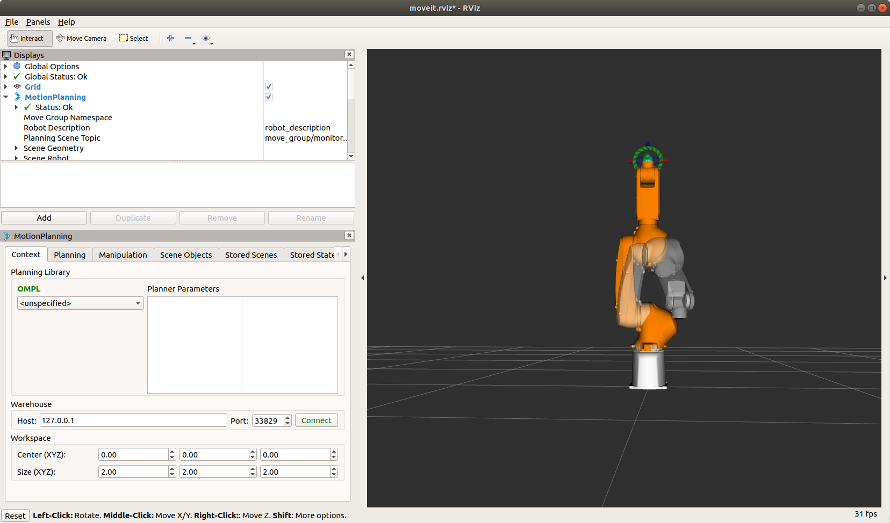
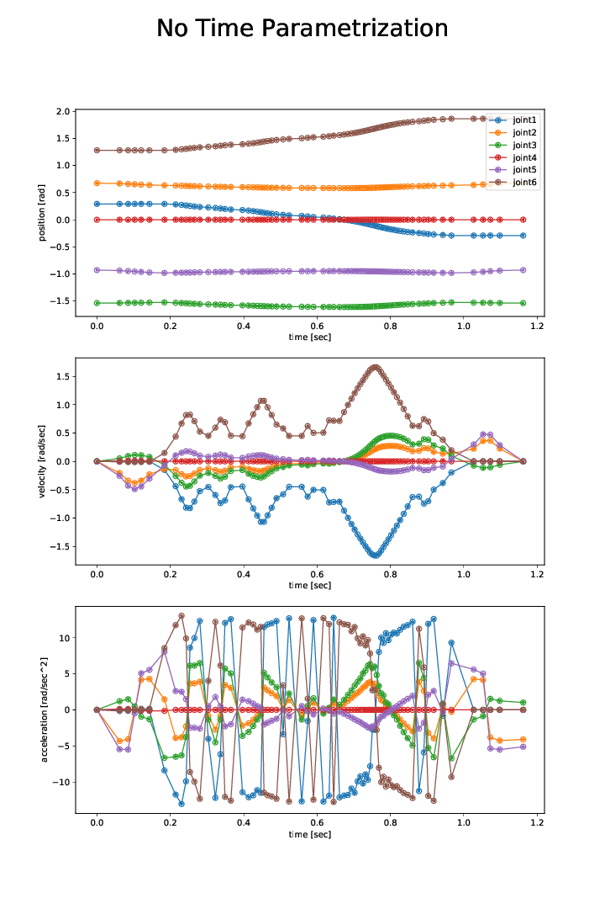
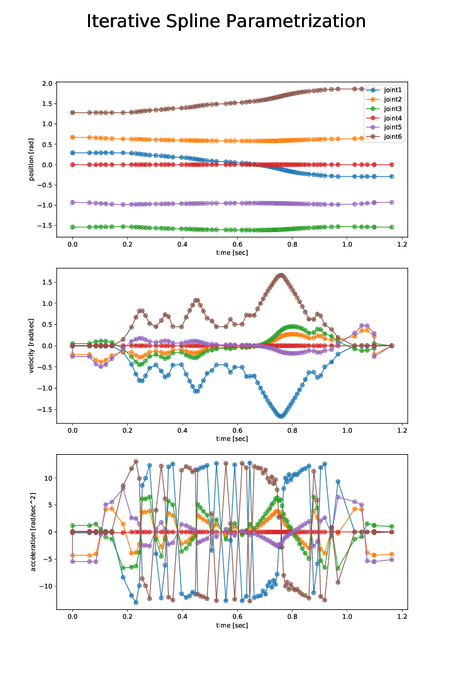
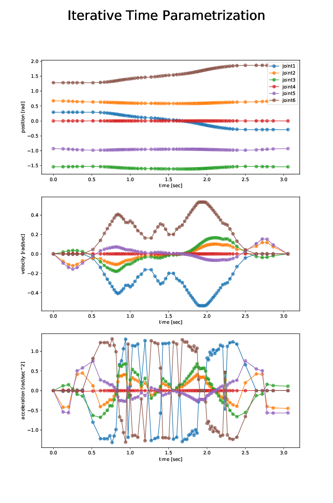
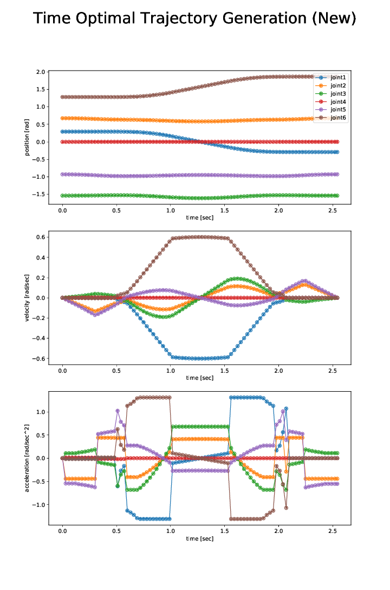

# Demo of rs007n

## Adept motion with Python interface

### How to run



```
roslaunch khi_rs007n_moveit_config demo.launch
rosrun moveit_tutorials demo_adept_motion_rs007n.py
# Graph PDF is saved to /tmp/demo_adept_motion_rs007n.pdf
```

### [Comparison of time parameterization algorithms](doc/demo_adept_motion_rs007n_all.pdf)








